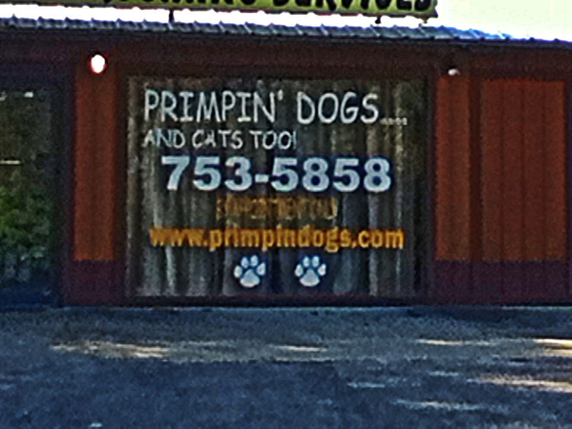

primpindogs
===========

This client really did not know what she wants.  Actually, she did not even know this site was being constructed.

The owner of this very small business in Lady Lake, Florida is apparently extremely naive or unaware of how the Internet operates.  When the business was opened (in a very small building on a rural road, off the main highway) the URL _primpindogs.com_ was painted in very, __very__ large letters on the front picture window.

One day, my "professional curiousity" led me to visit that domain with a browser.  It returned a 404.  I assumed the upcoming site had not yet been developed.  Fueled now to investigate further I checked the WHOIS record.  I wondered how long ago the domain had been registered and contemplated offering to help the sturggling small business-owner (gratis, of course).

You can not imagine the shock and disbelief that struck me when I discovered __THAT DOMAIN HAS NEVER BEEN REGISTERED__!  My immediate thought was that a nefarious "cyber-squatter" would register the domain and then hold the poor woman hostage.  {Remember, this domain name is in 24 inch letters across the front of her small building!}

I contemplated (as a joke - never seriously) registering the name, building a site that included a "special discount" only for large, black dogs (we have two large black dogs); simply to illustrate an important point.

Ultimately, I decided the right and proper thing to do was invest a few dollars to protect this naive and uniformed small-business owner from someone ruthless and corrupt and help the business at the same time.

I am a [skilled software developer](https://github.com/ParkinT/HireMe) and have a lot of Web experience.  I am also the very first to admit that I have NO DESIGN SKILLS.  This is from a Free Template I located on the web.

Pull Requests are welcome (and encouraged).  Thank you in advance.
=======
Simple, static HTML site (thanks to Github Pages)

